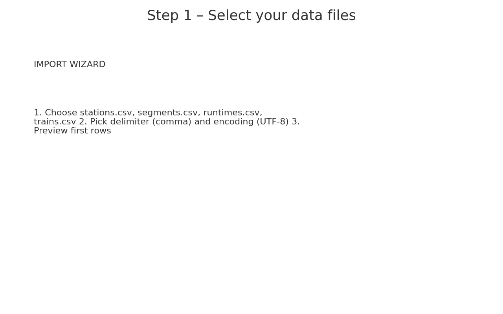
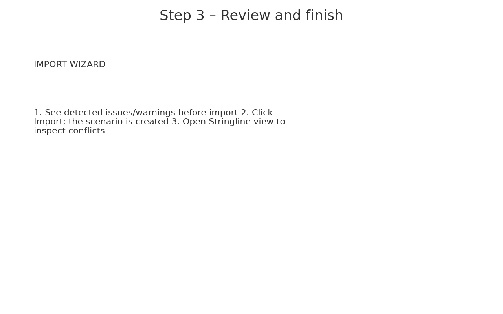

# SingleTrainTrackScheduler – TCDD Prototype

> **Single‑track railway timetable & dispatching prototype for Turkish State Railways (TCDD).**

<p align="center">
  
  
  
</p>

**Contents**
- [Overview](#overview)
- [Key Features](#key-features)
- [Repository / Solution Structure](#repository--solution-structure)
- [Tech Stack & Framework](#tech-stack--framework)
- [Requirements](#requirements)
- [Quick Start](#quick-start)
- [Data Model (CSV) & File Formats](#data-model-csv--file-formats)
- [Excel Import (Single workbook)](#excel-import-single-workbook)
- [Import Steps (visuals)](#import-steps-visuals)
- [Scheduling & Conflict Rules](#scheduling--conflict-rules)
- [Keyboard Shortcuts](#keyboard-shortcuts)
- [KPI Examples](#kpi-examples)
- [Roadmap](#roadmap)
- [Contributing](#contributing)
- [License](#license)
- [Türkçe (TR) açıklama](#türkçe-tr-açıklama)

---

## Overview
**SingleTrainTrackScheduler** is a Windows desktop prototype (C#/.NET) that assists planners in building **conflict‑free timetables on single‑track corridors**. It models stations, blocks/segments, and trains, checks headways and clearances, finds meet/pass points at loops, and supports both manual and automatic adjustments to resolve conflicts.

Typical workflow:
1. Define/import a line (stations + single‑track segments)
2. Import a draft plan of passenger/freight trains
3. Detect meets/follows and headway violations
4. Auto‑place or nudge trains to feasible slots while minimizing delay
5. Export a timetable and KPIs for reporting

> **Note:** The prototype focuses on **single‑track** planning; double‑track segments can be represented but are not the primary target yet.

## Key Features
- **Line & assets modeling**: Stations (with/without passing loops), segments/blocks, gradients/lengths, operating speeds.
- **Train plan modeling**: Train classes (passenger/freight), directions, priorities, planned dwell times.
- **Conflict detection**: Same‑direction headway, opposing‑direction meet/pass, clearance at block boundaries and stations.
- **Interactive timetable tools**: Distance–time (stringline) and grid views; manual adjust (drag/offset) plus rule‑based auto‑placement.
- **KPIs**: Total delay, max delay, number of conflicts, on‑time %.
- **Import/Export**: CSV/JSON for stations, segments, runtimes, and trains. Optional Excel export.
- **Project files**: Save/Load a complete scenario as a JSON “project”.

> Screenshots placeholder – add when available:  
> - `docs/img/stringline.png`  
> - `docs/img/conflict-list.png`

## Repository / Solution Structure
```
SingleTrainTrackScheduler-TCDD-Prototype/
├─ SingleTrainTrackScheduler.sln          # Visual Studio solution
├─ SingleTrainTrackScheduler/             # Desktop app (UI + logic)
└─ SingleTrainTrackScheduler.Setup/       # Installer project (optional)
```
Suggested layering inside `SingleTrainTrackScheduler/`:
```
Domain/        # Core entities (Station, Segment, Train, Stop, BlockOccupancy, etc.)
Services/      # ConflictChecker, Scheduler, RuntimeCalculator, Importers/Exporters
UI/            # Views, ViewModels (WPF/WinForms), Commands, Behaviors
Data/          # Repositories, Project persistence (JSON)
Config/        # AppSettings, default headways/clearances
Utils/         # Time helpers, validation, logging
```

## Tech Stack & Framework
> If your `.csproj` differs, adjust this section accordingly.

- **UI Framework**: WPF **or** Windows Forms (current prototype targets WPF)
- **Target Framework**: .NET 8.0 for Windows (`net8.0-windows`)
- **Output Type**: `WinExe`
- **Project SDK**: `Microsoft.NET.Sdk`
- **Installer**: Visual Studio Installer Projects (Setup) *(optional)*

**Sample `.csproj` (WPF, .NET 8):**
```xml
<Project Sdk="Microsoft.NET.Sdk">
  <PropertyGroup>
    <OutputType>WinExe</OutputType>
    <TargetFramework>net8.0-windows</TargetFramework>
    <UseWPF>true</UseWPF>
    <Nullable>enable</Nullable>
    <ImplicitUsings>enable</ImplicitUsings>
  </PropertyGroup>
</Project>
```

**NuGet packages** (used/recommended):
| Package | Why |
|---|---|
| **Newtonsoft.Json** | Save/Load project JSON; flexible serialization |
| **CsvHelper** | Robust CSV import/export for stations/segments/runtimes/trains |
| *(optional)* **CommunityToolkit.Mvvm** | Lightweight MVVM (INotifyPropertyChanged, RelayCommand) |
| *(optional)* **ScottPlot.WPF** or **LiveChartsCore.SkiaSharpView.WPF** | Stringline & KPI charts |

Install via CLI:
```bash
# From the project folder
dotnet add package Newtonsoft.Json
dotnet add package CsvHelper
# optional
dotnet add package CommunityToolkit.Mvvm
# choose one charting lib
# dotnet add package ScottPlot.WPF
# dotnet add package LiveChartsCore.SkiaSharpView.WPF
```

## Requirements
- Windows 10/11
- Visual Studio 2019/2022 with **.NET desktop** workload
- (Optional) Excel installed for direct `.xlsx` export

## Quick Start
1. **Clone** the repository:
   ```bash
   git clone https://github.com/mertrone/SingleTrainTrackScheduler-TCDD-Prototype.git
   ```
2. **Open** `SingleTrainTrackScheduler.sln` in Visual Studio.
3. **Set startup project** to `SingleTrainTrackScheduler`.
4. **Restore NuGet packages** and **Build**.
5. **Run** the app and create a new project or **Import** CSV/Excel.

> Tip: Start with the supplied demo data (below) – small corridor, 5 stations, 6 trains – to get used to conflict messages and resolution tools.

## Data Model (CSV) & File Formats
The app reads/writes simple CSV/JSON files. Suggested CSV schemas:

### `stations.csv`
| column           | type     | required | notes |
|------------------|----------|----------|-------|
| station_id       | string   | ✓        | unique key |
| name             | string   | ✓        | display name |
| km               | number   | ✓        | cumulative distance (km) along line |
| has_passing_loop | 0/1|bool | ✓        | loop siding available for meets |
| dwell_default_s  | integer  |          | default dwell seconds |

### `segments.csv`
| column        | type    | required | notes |
|---------------|---------|----------|-------|
| segment_id    | string  | ✓        | unique key |
| from_station  | string  | ✓        | station_id |
| to_station    | string  | ✓        | station_id |
| length_km     | number  | ✓        | segment length |
| single_track  | 0/1|bool| ✓        | true for single‑track |
| vmax_kmh      | number  |          | operating speed limit |

### `runtimes.csv` (optional)
| column       | type   | required | notes |
|--------------|--------|----------|-------|
| segment_id   | string | ✓        | |
| train_class  | enum   | ✓        | e.g., PASSENGER, FREIGHT |
| run_time_s   | int    | ✓        | traversal time for that class |

### `trains.csv`
| column          | type     | required | notes |
|-----------------|----------|----------|-------|
| train_id        | string   | ✓        | unique key |
| class           | enum     | ✓        | PASSENGER/FREIGHT |
| priority        | integer  |          | lower = more priority (e.g., 1..5) |
| origin_station  | string   | ✓        | station_id |
| destination     | string   | ✓        | station_id |
| dep_time        | datetime | ✓        | `YYYY-MM-DD HH:MM:SS` |
| planned_stops   | json     |          | `[{"station_id":"S2","dwell_s":45}, ...]` |

### Project JSON (example)
```json
{
  "meta": { "name": "Kavak–Yaman demo", "created": "2025-09-09" },
  "line":  {
    "stations": [ { "station_id": "S1", "name": "Kavak", "km": 0, "has_passing_loop": true }, ... ],
    "segments": [ { "segment_id": "B1", "from_station": "S1", "to_station": "S2", "single_track": true, "length_km": 7.5 } ]
  },
  "runtimes": [
    { "segment_id": "B1", "train_class": "PASSENGER", "run_time_s": 300 }
  ],
  "trains": [
    { "train_id": "P101", "class": "PASSENGER", "origin_station": "S1", "destination": "S5", "dep_time": "2025-09-10 08:00:00" }
  ]
}
```

## Excel Import (Single workbook)
You can import an **all‑in‑one Excel** instead of separate CSV files. A template matching the schema above is provided.

**Expected Sheets**
- **Stations**: `station_id, name, km, has_passing_loop (0/1), dwell_default_s`
- **Segments**: `segment_id, from_station, to_station, length_km, single_track (0/1), vmax_kmh`
- **Runtimes**: `segment_id, train_class (PASSENGER/FREIGHT), run_time_s`
- **Trains**: `train_id, class, priority, origin_station, destination, dep_time (YYYY-MM-DD HH:MM:SS), planned_stops (JSON)`

**Downloads**
- Demo workbook (single file): **`docs/demo/SingleTrack_Example_Demo.xlsx`**
- Alternative sample you shared: **`docs/demo/SingleTrack_Example_Easy.xlsx`**

> Place the files under `docs/demo/` in the repo (or import directly from disk). Date/time cells should be real Excel datetimes or text in `YYYY-MM-DD HH:MM:SS`. Avoid merged cells and fancy formatting in headers so parsers map columns reliably.

## Import Steps (visuals)
Add these images under `docs/img/` and reference them in the repo:

1. **Step 1 – Select files**  
   
2. **Step 2 – Map columns**  
   
3. **Step 3 – Review & finish**  
   

## Scheduling & Conflict Rules
**Block occupancy** is enforced on each single‑track segment and platform block. Conflicts the checker should detect:

1. **Follow (same direction)**: Train B enters a block too soon after Train A.  
   *Rule:* `enter_B ≥ exit_A + HEADWAY_follow`.
2. **Meet (opposing direction)** on single‑track: Trains must cross at a passing loop.  
   *Rule:* opposing trains may only occupy the **same segment** if one is fully clear, or both are held at loop stations.
3. **Station/platform clearance**: Protects turn‑arounds and dwell‑overlap.  
   *Rule:* `depart_next ≥ arrive_prev + DWELL + CLEARANCE_platform`.

**Auto‑scheduling (prototype heuristics):**
- Insert/shift trains to the **earliest feasible** times that satisfy rules.
- **Priority‑aware** (e.g., passenger > freight) and **EDD/CR** tie‑breakers.
- Optional **minimize total delay** objective for batched placement.

## Keyboard Shortcuts
Wire these to commands (WPF `InputBindings` or WinForms equivalents):

| Shortcut | Action |
|---|---|
| **Ctrl+N** | New project |
| **Ctrl+O** | Open project |
| **Ctrl+I** | Import CSV/Excel |
| **Ctrl+S** | Save project |
| **Ctrl+E** | Export timetable/KPIs |
| **Ctrl+G** | Run Conflict Check |
| **Ctrl+R** | Auto‑Schedule selected/all |
| **Ctrl+Z / Ctrl+Y** | Undo / Redo |
| **Del** | Delete selected train |
| **←/→** | Nudge selected train ±1 min |
| **Shift+←/→** | Nudge selected train ±5 min |
| **F1** | Help / README |

**Example (XAML):**
```xml
<Window.InputBindings>
  <KeyBinding Modifiers="Control" Key="N" Command="{Binding NewProjectCommand}"/>
  <KeyBinding Modifiers="Control" Key="O" Command="{Binding OpenProjectCommand}"/>
  <KeyBinding Modifiers="Control" Key="I" Command="{Binding ImportCsvCommand}"/>
  <KeyBinding Modifiers="Control" Key="S" Command="{Binding SaveProjectCommand}"/>
  <KeyBinding Modifiers="Control" Key="G" Command="{Binding CheckConflictsCommand}"/>
  <KeyBinding Modifiers="Control" Key="R" Command="{Binding AutoScheduleCommand}"/>
</Window.InputBindings>
```

## KPI Examples
- `#conflicts`
- `Σ delay`
- `max delay`
- `% on‑time`
- `#meets at loops`

## Roadmap
- Export **distance–time (stringline) PDF** and conflict reports
- **Automated meet/pass placement** improvements (loop selection)
- **Exact optimization** via Google OR‑Tools (CP‑SAT) or MILP for selected windows
- Multi‑line / junction support
- Scenario diff and KPIs dashboard
- **TR/EN localization** and printing layouts

## Contributing
Contributions are welcome!
1. Fork and create a feature branch.
2. Follow C# coding conventions; prefer MVVM if WPF.
3. Add unit tests for conflict rules and a small sample dataset.
4. Submit a PR with screenshots/GIFs and a short design note.

## License
Released under the **MIT License**. See `LICENSE.txt`.

---

## Türkçe (TR) açıklama

### Genel Bakış
**SingleTrainTrackScheduler**, **tek hat** demiryolu hatlarında (TCDD) **çatışmasız tren çizelgesi** oluşturmayı amaçlayan bir masaüstü prototiptir (C#/.NET). İstasyonlar, hat/bloklar ve trenleri modeller; **takip baş mesafesi**, **karşılıklı tren karşılaşmaları (meet/pass)** ve **temizlik süreleri** gibi kurallara göre çatışmaları bulur; manuel veya otomatik düzenleme ile çözer.

**Tipik akış:** Hat/istasyon tanımı → Tren planı içe aktarımı → Çatışma tespiti → Otomatik/manuel yerleştirme → KPI’lar ve dışa aktarma.

### Öne Çıkanlar
- **Hat modelleme:** İstasyon, blok/segment, makas/yan yol (passing loop)
- **Tren planı:** Yolcu/Yük sınıfları, yön, öncelik, duruş/dwell
- **Çatışma kuralları:** Aynı yönde takip baş mesafesi, karşı yönde meet/pass, istasyon/peron temizlikleri
- **Etkileşimli görünüm:** Zaman‑mesafe (stringline) diyagramı ve tablo
- **İçe/dışa aktarma:** CSV/JSON veya tek dosya Excel
- **KPI’lar:** Toplam gecikme, en büyük gecikme, on‑time %, meet sayısı

### Kurulum & Çalıştırma (Kısa)
- Windows 10/11 + Visual Studio 2019/2022 (.NET desktop iş yükü)
- Depoyu klonlayın, `SingleTrainTrackScheduler.sln`’i açın
- Başlangıç projesini **SingleTrainTrackScheduler** yapın → NuGet geri yükle → Build → Çalıştırın
- CSV/Excel ile **içe aktarım** yapın

### Dosya Biçimleri
- `stations.csv`: `station_id,name,km,has_passing_loop,dwell_default_s`
- `segments.csv`: `segment_id,from_station,to_station,length_km,single_track,vmax_kmh`
- `runtimes.csv`: `segment_id,train_class,run_time_s`
- `trains.csv`: `train_id,class,priority,origin_station,destination,dep_time,planned_stops`

### Excel ile İçe Aktarım
- **Sayfalar:** `Stations`, `Segments`, `Runtimes`, `Trains`  
- **İndirme:** `docs/demo/SingleTrack_Example_Demo.xlsx` (tek dosya demo)  
  Alternatif örnek: `docs/demo/SingleTrack_Example_Easy.xlsx`

> Tarih/saat hücreleri gerçek Excel datetime veya `YYYY-MM-DD HH:MM:SS` formatında metin olmalı. Başlıklarda birleşik hücre kullanmayın.

### Kısayollar
- **Ctrl+N**: Yeni proje, **Ctrl+O**: Aç, **Ctrl+I**: İçe aktar, **Ctrl+S**: Kaydet  
- **Ctrl+G**: Çatışma kontrolü, **Ctrl+R**: Otomatik çizelgele  
- **Ctrl+Z / Ctrl+Y**: Geri al / İleri al, **Del**: Sil  
- **←/→**: 1 dk kaydır, **Shift+←/→**: 5 dk kaydır, **F1**: Yardım

### Yol Haritası
- PDF çıktı (stringline) ve çatışma raporları
- Meet/pass yer seçimi iyileştirmeleri
- OR‑Tools CP‑SAT veya MILP ile seçili pencerede **optimizasyon**
- Çok hatlı/junction’lı senaryolar
- TR/EN yerelleştirme ve yazdırma şablonları

---

> **Credits**: Project owner/maintainer: @mertrone.
